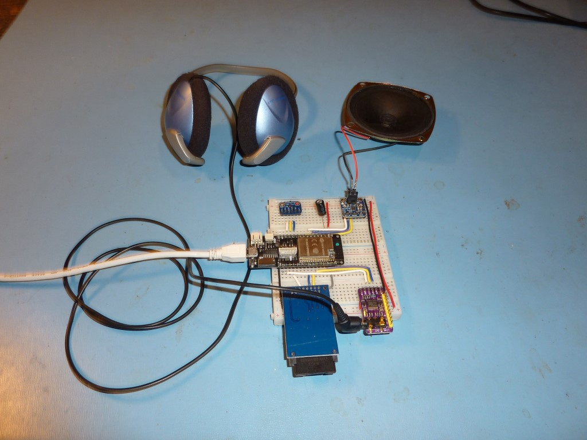
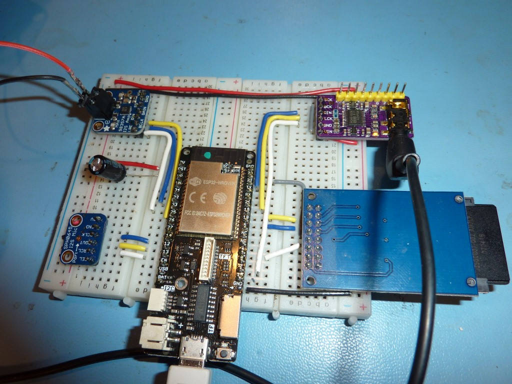

# MicroPython I2S Guide and Examples for ESP32

This guide outlines the capabilities of a new MicroPython I2S class that is proposed for the MicroPython project.  The I2S class is implemented using Espressif's ESP-IDF API.

The I2S class is designed to be implemented on other MicroPython ports and follows patterns seen in the MicroPython machine module classes.

from Wikipedia:

"I²S (Inter-IC Sound), pronounced eye-squared-ess, is an electrical serial bus interface standard used for connecting digital 
audio devices together. It is used to communicate PCM audio data between integrated circuits in an electronic device".

# class I2S

**Example usage - I2S Master Receive - Adafruit I2S MEMS Microphone (SPH0645LM4H)**

```
from machine import I2S
from machine import Pin

bck_pin = Pin(14)  # Bit clock output
ws_pin = Pin(13)   # Word clock output
sdin_pin = Pin(12) # Serial data input

audio_in = I2S(I2S.NUM0,                                 # create I2S peripheral to read audio
               bck=bck_pin, ws=ws_pin, sdin=sdin_pin,    # sample data from an Adafruit I2S MEMS
               standard=I2S.PHILIPS, mode=I2S.MASTER_RX, # microphone breakout board, 
               dataformat=I2S.B32,                       # based on SPH0645LM4H device
               channelformat=I2S.RIGHT_LEFT,
               samplerate=16000, 
               dmacount=16,dmalen=256)
               
samples = bytearray(2048)                                # bytearray to receive audio samples

num_bytes_read = audio_in.readinto(samples)              # read audio samples from microphone
                                                         # note:  blocks until sample array is full
                                                         # - see optional timeout argument
                                                         # to configure maximum blocking duration       
```
***
**Example usage - I2S Master Transmit - Adafruit I2S 3W Class D Amplifier Breakout - MAX98357A**

```
from machine import I2S
from machine import Pin

bck_pin = Pin(14)   # Bit clock output
ws_pin = Pin(13)    # Word clock output
sdout_pin = Pin(12) # Serial data output

audio_out = I2S(I2S.NUM1,                                  # create I2S peripheral to write audio
                bck=bck_pin, ws=ws_pin, sdin=sdout_pin,    # sample data to an Adafruit I2S Amplifier
                standard=I2S.PHILIPS, mode=I2S.MASTER_TX,  # breakout board, 
                dataformat=I2S.B16,                        # based on MAX98357A device
                channelformat=I2S.ONLY_RIGHT,
                samplerate=16000, 
                dmacount=16,dmalen=512)
               
samples = bytearray(1024)                                 # bytearray containing audio samples to transmit

num_bytes_written = audio_out.write(samples)              # write audio samples to amplifier
                                                          # note:  blocks until sample array is emptied
                                                          # - see optional timeout argument
                                                          # to configure maximum blocking duration       
```

## Constructor
```
class machine.I2S(id,
                  bck, ws, [sdin], [sdout], 
                  [standard=I2S.PHILIPS], mode, 
                  dataformat, channelformat, 
                  samplerate,
                  [dmacount=16], [dmalen=64],
                  [apllrate=0])
```
Construct and return a new I2S object with the given arguments:
  * **id** specifies I2S peripheral instance
  * **bck** pin object for the bit clock output
  * **ws** pin object for the word select output
  * **sdin** pin object for the serial data input (optional)
  * **sdout** pin object for the serial data output (optional)
  * **standard** protocol used by the I2S peripheral (optional)
  * **mode** specifies receive or transmit
  * **dataformat** number of bits in each sample
  * **channelformat** specifies audio format, e.g. stereo, mono
  * **samplerate** audio sampling rate (samples/s)
  * **dmacount** number of linked DMA buffers (optional)  [ESP32 specific] 
  * **dmalen** length of each DMA buffer (in samples) (optional) [ESP32 specific]   
  * **apllrate** audio PLL sampling rate (samples/s) (optional) [ESP32 specific]      
  
Notes:  
  * **sdin** must be specified for mode = I2S.MASTER_RX
  * **sdout** must be specified for mode = I2S.MASTER_TX
  * only one of **sdin** or **sdout** can be specified
  * **apllrate** allows precise specification of the sampling clock rate.  Not needed for most audio applications.  See ESP-IDF docs for usage

## Methods
```
I2S.init(bck, ...)
```
Initialize the I2S peripheral with the given arguments:
  * see Constructor for argument descriptions

***  
```
I2S.deinit()
```

Deinitialize the I2S peripheral

***
```
I2S.readinto(buf, [timeout = -1])
```

Read audio samples from an I2S peripheral with the given arguments:

  * **buf** receive buffer.  Must support buffer protocol, such as bytearray or array  
  * **timeout** maximum time to wait for a DMA buffer (in ms). If no DMA buffer is available in **timeout** ms the function will return. Default = wait forever to fill buf.  See discussion below on *Understanding the timeout argument* [ESP32 specific]      
  
Notes:  
  * method blocks until buf is *completely* filled from DMA memory, unless timeout is specified 
  * The DMA engine works in the background, filling DMA buffers with audio samples read from the I2S peripheral.  The MicroPython runtime is not impacted by this DMA operation.

**Returns** number of bytes read  

***
```
I2S.write(buf, [timeout = -1])
```
Write audio samples to I2S peripheral with the given arguments:

  * **buf** transmit buffer.  Must support buffer protocol, such as bytearray or array
  * **timeout** maximum time to wait for a DMA buffer (in ms). If no DMA buffer is available in **timeout** ms the function will return.  Default = wait forever to write buf.  See discussion below on *Understanding the timeout argument* [ESP32 specific]      
    
Notes:  
  * method blocks until buf is *completely* copied to DMA memory, unless timeout is specified 
  * The DMA engine works in the background, transfering audio sample from DMA buffers to the I2S peripheral.  The MicroPython runtime is not impacted by this DMA operation.

**Returns** number of bytes written      type
***

## Constants

**id** of I2S peripheral

```
I2S.NUM0, I2S.NUM1
```
***

**standard** of I2S peripheral

```
I2S.PHILIPS, I2S.LSB
```
***

**mode** of I2S peripheral

```
I2S.MASTER_RX, I2S.MASTER_TX
```
***

**dataformat** of I2S peripheral

```
I2S.B16, I2S.B24, I2S.B32
```
***

**channelformat** of I2S peripheral

```
I2S.RIGHT_LEFT, I2S.ALL_RIGHT, I2S.ALL_LEFT, I2S.ONLY_RIGHT, I2S.ONLY_LEFT,
```
See section below "Understanding Channel Format"
***
 
### ESP32 Boards Tested
  * Adafruit Huzzah Feather ESP32 with external SDCard
  * Lolin D32 Pro
  
### I2S Boards Tested
  * Adafruit I2S MEMS Microphone Breakout - SPH0645LM4H
  * Adafruit I2S 3W Class D Amplifier Breakout - MAX98357A
  * I2S PCM5102 Stereo DAC Decoder available on ebay, aliexpress, amazon

### DMA considerations
The ESP32 I2S peripherals use DMA to transfer data between the user application and an external I2S hardware peripheral.  DMA memory is implemented as a linked-list of DMA buffers and is specified by the two constructor arguments `dmacount` and `dmalen`.

DMA runs continuously in the background and allows user applications to perform other operations while sample data is transfered between DMA memory and the I2S hardware. In general, more DMA memory = more time that user applications can operate before DMA "undderruns" or "overruns" happen.
  
**DMA memory allocation**

`DMA memory allocated (in bytes) = dmacount * sizeof-a-dma-buffer-in-bytes`

**Understanding DMA buffer size**

It is intuitive to think that `sizeof-a-dma-buffer-in-bytes` equals `dmalen`. **This is not the case**.  `dmalen` is related to the number of data *samples*.  `sizeof-a-dma-buffer-in-bytes` is calculated as follows:

`sizeof-a-dma-buffer-in-bytes = dmalen * # bytes/sample * # channels`

where `# channels` refers to mono versus stereo operation:
  * mono = 1 channel, (channelformat=ONLY_RIGHT, ONLY_LEFT)
  * stereo = 2 channels, (channelformat=RIGHT_LEFT, ALL_RIGHT, or ALL_LEFT)

example:  dmalen=128, dataformat=32bits, channelformat=RIGHT_LEFT (e.g. stereo)
  * sizeof-a-dma-buffer-in-bytes = 128 \* 4 \* 2 = 1024 bytes

**Sizing 'buf' for readinto()**:  For efficient use of allocated memory, the sizeof `buf` should be an integer multiple of the DMA buffer size.  Larger `buf` sizes can be advantageous when writing samples to internal flash memory or external SDCards.  A larger `buf` will permit a continuous bulk write to memory, which is more efficient than multiple small block writes. 

**Sizing 'buf' for write()**:  Similar to the read() method, the sizeof `buf` should be an integer multiple of the DMA buffer size.  For a *simple* design using the `timeout` argument, the sizeof `buf` can be equal to the sizeof the DMA buffer.  Why? The entire contents of `buf` can be written to a DMA memory buffer in one pass, which avoids possible design complications of dealing with residual samples remaining in `buf`.

### Understanding the timeout argument
The optional `timeout` argument in the readinto and write methods specifies the maximum amount of time (in ms) that these method calls wait for a DMA buffer to become available. If `timeout = 0` is specified, then the readinto and write methods will return "immediately" (measured ~125us) when:
  * no DMA buffer is available with data to read (readinto method)
  * no DMA buffer is available to be filled (write method) 
  
The `timeout` argument allows application code to effectively poll DMA memory and then perform other operations when all DMA buffers are empty (readinto method) or full (write method).

### Understanding the Channel Format argument
The `channelformat` constructor argument determines how sample data is mapped to the sdin, sdout, and bck I2S signals.  The relationships can be understood through example, showing oscilloscope captures of the relevant I2S signals.

The following oscilloscope captures use data contained in the following WAV file:

../wav_files/pattern-16k-32bits.wav

The first sample starts at byte 44 (00 00 00 FF).  WAV data is little endian format.  In the images below, the sample values are indicated below the SDOUT signal (e.g, "0xFF 00 00 00", etc). 

**channelformat = RIGHT_LEFT**

Example:  output stereo audio data to an I2S DAC device that supports 2 channels (stereo)


**channelformat = ALL_LEFT**

Example:  output Left channel stereo audio data to an I2S DAC device that supports 1 channel


**channelformat = ALL_RIGHT**

Example:  output Right channel stereo audio data to an I2S DAC device that supports 1 channel


**channelformat = ONLY_LEFT or ONLY_RIGHT**

Example:  output audio data to an I2S DAC device that supports 1 channel


### Enhancements to consider
The initial I2S class implementation is a "minimum viable product" (MVP).  It offers basic capabilities to implement many audio I2S applications.  Based on feedback, enhancements can be considered, including:
  * full duplex
  * slave mode
  * non-blocking read and write with callback on completion
  * uasyncio implementation
  * stream protocol implemention
  * exposing I2S events to detect gaps in the sample stream.  e.g. underrun (Master Tx) and overrun (Master Rx) in DMA buffering
  
Many enhancements will require implementation at the ESP32 I2S register level.  I2S registers are described in the ESP32 Technical Reference Manual.  Register descriptions are minimal, but the existing ESP-IDF I2S API code can be reverse-engineered for a more complete understanding.

### MicroPython examples
MicroPython code is contained in the *examples* folder.  WAV files used in the examples are contained in the *wav_files* folder
#### 1. Play mono WAV file using Adafruit I2S 3W Class D Amplifier Breakout - MAX98357A
MicroPython code:
  * play-mono-wav.py

WAV files (copy to file system using rshell, ampy, etc)
  * taunt-16k-16bits-mono.wav
  * taunt-16k-16bits-mono-12db.wav  (-12db version)

#### 2. Play stereo WAV file using I2S PCM5102 Stereo DAC Decoder
MicroPython code:
  * play-stereo-wav.py

WAV file  (copy to file system using rshell, ampy, etc):
  * side-to-side-8k-16bits-stereo.wav

#### 3. Record 16 bit audio to SDCard WAV file using Adafruit I2S MEMS Microphone Breakout - SPH0645LM4H
MicroPython code:
  * read-mic-write-external-sdcard.py

Note: imports sdcard.py.  Copy sdcard.py into filesystem from micropython/drivers/sdcard folder 

#### 4. Record 16 bit audio to internal filesystem using INMP441 Microphone
MicroPython code:
  * read-mono-mic-write-internal-flash.py

Note:  Compared to example 3, this implementation uses 1/4 the DMA memory and does not require a prune() function.  Credit:  @MikeShi42 

#### 5. Record 32 bit audio to SDCard WAV file using Adafruit I2S MEMS Microphone Breakout - SPH0645LM4H
MicroPython code:
  * read-mono-mic-write-external-sdcard-32bits.py

Notes: 
  * imports sdcard.py.  Copy sdcard.py into filesystem from micropython/drivers/sdcard folder
  * uses efficient DMA configuration.  Credit:  @MikeShi42 

### Testing Setup






